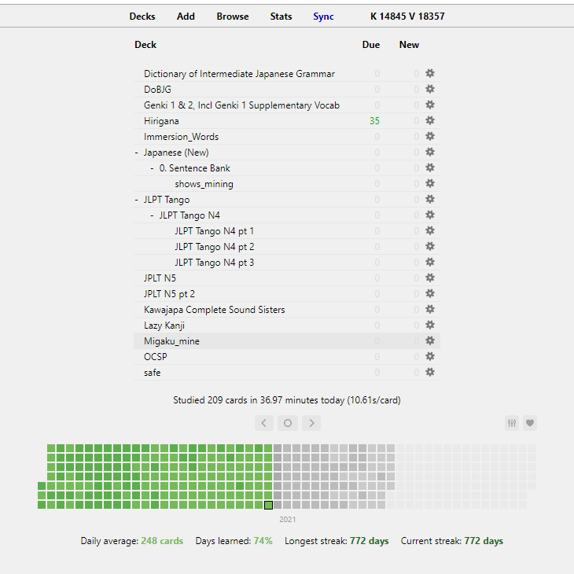

初めましてschumact「シゥウマクト」です。今日ブログを書き始めることにした。理由は半分日本語能力を向上するためで他の半分はセキュリティとプログラミングの話のため。この投稿には日本語の経験のみが載っている。
それでは私の日本語の始まり。まずはちょっとした背景。今、私は二十代の前半で２０１９二月まで日本語を勉強したことがなかった。２０１４まで日本語に興味を持ったこともなかった。日本語に興味を持つ切っ掛けは大学一年生
のとき、私のルームメートがパソコンでアニメを見るのを気づいたことだ。何を見ていたかわからなかったけどうるさかった。彼がそのアニメを見終わったところで彼は私にアニメがなんなのかを説明してくれたんだ。その頃の数ヶ月のあと夏休みが始まった。私は故郷に戻ってドラゴンボールを見始めた。もちろん英語吹き替えたままで。それで時間の流れと少しずつアニメを日本語で見ることにし始めた。そこから日本の文化と他のメディアに介して日本語の勉強を始めることを決めたんだ。最初はGenki 1とGenki 2という本で単語や文法を覚える。一周に一章を完遂するのが目的だった。こんなふうに二ヶ月ぐらい毎日勉強してきた。2019年5月にニューヨークに旅行したときもしっかり新しいチャプターを勉強した。Genkiってで勉強し続けば続くほど漢字がどんどん現れる。最初に感じはめっちゃ難しかった。どうすればいいのと悩んでた。その時Redditというサイトで漢字の正しい学び方は何なんだかって質問を投稿した。その投稿のリプの中である男がRemembering the Kanji (RTK)という本をおすすめした。それとも別の勉強方法をも述べた。まず、RTKが教えるのは２２００ぐらいの漢字の意味（英語の言葉と連想する）だ。別の勉強方法はAnkiというソフトウェアアプリでTango 1とTango2という本の単語をフラッシュカードにして学習することだ。ちなみにRTKの漢字もAnkiで学習してる。この方法は今にもしっかりフォローしてる。

Tango 1とTango ２の単語はもう全部覚えてるから最低15新しい単語を毎日Ankiに入れておくことにしたんだ。幸い日本語を勉強したい人の中でたくさん頭のいいプログラマーがいる。その人達が様々なツールを作ってたから単語をアニメやドラマから撮ってAnkiでフラッシュカードにすることができる。依然として私はほぼAnkiとインプット系のことだけで日本語を学び続けてる。日本語の読む能力と聞く能力がアウトプット的なことを上回ってるのは当然。書くことと話すことに関してはいくつかの経験があるんだけどインプット的なことと比べれば差が甚だしすぎる。その理由でこのブログを作った。この文までやく９０分がかかったｗｗ。HelloTalkというアプリ以外に何かを書いた経験がなかったけど。まあこの辺で区切りをつけると思う。Ankiを詳しく説明する投稿が次かな。誰かがこの投稿を読んでくれたなら嬉しい。どうやってこのブログを見つけたのかが知りたいがリプのところがないから教えることができない。まあいい。読んでくれてありがとう。またね
